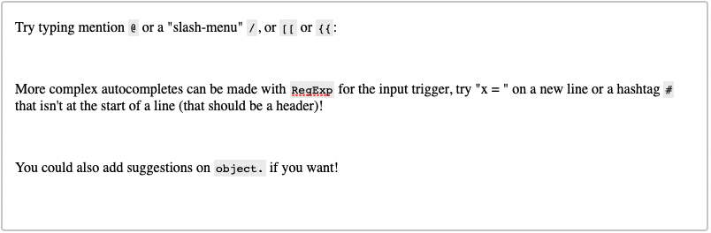

# `prosemirror-autocomplete`

[](https://www.npmjs.com/package/prosemirror-autocomplete)
[](https://github.com/curvenote/prosemirror-autocomplete/blob/master/LICENSE)

[](https://curvenote.github.io/prosemirror-autocomplete/)

A plugin for [ProseMirror](https://prosemirror.net/) that adds triggers for `#hashtags`, `@mentions`, `/menus`, and other more complex autocompletions.

[](https://curvenote.github.io/prosemirror-autocomplete/)

## Install

```bash
npm install prosemirror-autocomplete
```

Or see the [live demo here](https://curvenote.github.io/prosemirror-autocomplete/)!

## Overview

`prosemirror-autocomplete` allows you to have fine-grained control over an autocomplete suggestion, similar to an IDE but simple enough for `@` or `#` mentions.

```ts
import autocomplete, { Options } from 'prosemirror-autocomplete';

const options: Options = {
  reducer,
  triggers: [
    { name: 'hashtag', trigger: '#' },
    { name: 'mention', trigger: '@' },
  ],
};

const view = new EditorView(editor, {
  state: EditorState.create({
    doc: DOMParser.fromSchema(schema).parse(content),
    plugins: [...autocomplete(options), ...otherPlugins],
  }),
});
```

The function `autocomplete` takes a `reducer` and a list of triggers, it returns a two plugins: (1) a decoration plugin that wraps the input, and (2) a `InputRule` plugin that has a series of triggers that are defined in the options.

## Defining a Trigger

By default, you give a trigger a name, and a `trigger` string or `RegExp`. For example, a simple trigger can just use a single string:

```ts
import type { Trigger } from 'prosemirror-autocomplete';

const mentionTrigger: Trigger = { name: 'mention', trigger: '@' };
```

This trigger gets wrapped in a regular expresion:

```ts
const equivalentTrigger = /(?:^|\s|\n|[^\d\w])(@)$/;
```

This does what you want most of the time, ensuring that you don't trigger when writing an email, or if you are writing something else. This is a bit more strict than you might want for a social plugin, which picks up hashtags or mentions anywhere you write them.

If you want this to come up all the time, try:

```ts
const peskyMentionTrigger: Trigger = { name: 'mention', trigger: /(@)$/ };
```

Provide the trigger in the matched group and anything before in a non-capture group (`(?:)`), this will help you split the action into a `action.search` and an `action.trigger`.

## Defining a Reducer

The library does not come with any user interface, you will have to do that when you get an action from the autocomplete plugin.

```ts
import { AutocompleteAction, KEEP_OPEN } from 'prosemirror-autocomplete';

export function reducer(action: AutocompleteAction): boolean {
  switch (action.kind) {
    case ActionKind.open:
      handleSearch(action.search);
      placeSuggestion(true);
      return true;
    case ActionKind.select:
      // This is on Enter or Tab
      const { from, to } = action.range;
      const tr = action.view.state.tr.deleteRange(from, to).insertText('You can define this!');
      action.view.dispatch(tr);
      return true;
      // Or if you want to keep the suggestion open after selecting:
      return KEEP_OPEN;
    case ActionKind.close:
      // Hit Escape or click outside of the suggestion
      closeSuggestion();
      return true;
    case ActionKind.previous:
      // An up arrow
      selectSuggestion(-1);
      return true;
    case ActionKind.next:
      // A down arrow
      selectSuggestion(+1);
      return true;
    default:
      return false;
  }
}
```

## Positioning a Suggestion

You can use something like (popper.js)[https://popper.js.org/] to ensure that the suggestion stays in the right place on scroll or simply an abolutely positioned div.

```ts
import { DEFAULT_ID } from 'prosemirror-autocomplete';

function placeSuggestion(open) {
  suggestion.style.display = open ? 'block' : 'none';
  const rect = document.getElementById(DEFAULT_ID)?.getBoundingClientRect();
  suggestion.style.top = `${rect.top + rect.height}px`;
  suggestion.style.left = `${rect.left}px`;
}
```

If you don't want to use the `DEFAULT_ID` provided (`'autocomplete'`) then you can provide your own for any trigger:

```ts
const options: Options = {
  handler: reducer,
  triggers: [
    {
      name: 'command',
      trigger: '/',
      decorationAttrs: { id: 'myId', class: 'myClass' },
    },
  ],
};
```

This will allow you to specify styling of the wrapped decoration (which is a `<span>`). This can be different based on the trigger type.

## Related Projects

There are a few other packages that offer similar functionality:

- [prosemirror-suggestions](https://github.com/quartzy/prosemirror-suggestions)
- [prosemirror-mentions](https://github.com/joelewis/prosemirror-mentions)
- [prosemirror-suggest](https://github.com/remirror/remirror/tree/next/packages/prosemirror-suggest)

`prosemirror-suggestions` is similar in that it does not provide a UI, if you want a UI out of the box you can look at `prosemirror-mentions`. All three of these libraries trigger based on RegExp and leave the decorations in the state. This is similar to how twitter works, but is undesirable in writing longer documents where you want to dismiss the suggestions with an escape and not see them again in that area.

This library, `prosemirror-autocomplete`, works based on an input rule and then a decoration around the chosen area meaning you can target the suggestion specifically and dismiss it with ease.
